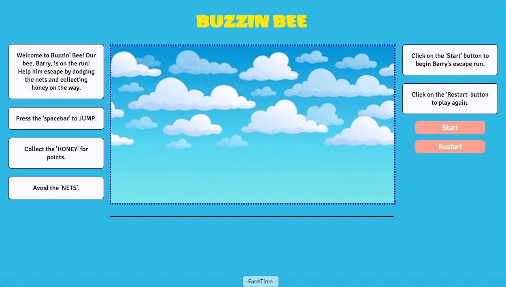

# Buzzin' Bee

[Buzzin' Bee][live]

[live]: https://beebeean09.github.io/BuzzinBee/

## Background

Buzzin' Bee is a Javascript game inspired by Jetpack Joyride. It features Barry, a bee on the run! The player will be able to fly up and down using the spacebar. But be careful! There will be oncoming nets trying to catch him. If he gets caught, it will end the game. Collect the honey on the way for points! Yum!

## Features & Implementation

### Side-Scrolling

In order to have a side-scrolling background, I created one canvas for the background image and one for all the other objects to be drawn on. The background image is loaded first onto its canvas, while its x-axis is incremented by a value(speed) in a setInterval. Then the images for the other objects are loaded onto a separate canvas afterwards, since I want the objects to be drawn on top of the background. Using CSS, I gave both canvas an absolute position within a relative parent container and gave them the same margins.



Below is how I implemented the side-scrolling background image:

```javascript
  animateBg(canvas, ctx, img) {
    let x = canvas.width;
    let speed = 2;
    let h = canvas.height;
    let w = canvas.width;

    setInterval(function() {
      ctx.drawImage(img, 0, 0, w, h, x, 0, w, h);
      ctx.drawImage(img, w - x, 0, w, h, 0, 0, w, h);

      x = x < 0 ? canvas.width : x - speed;

    }, 1000/50);

  }

  startBg(canvas, ctx) {
    let img = new Image();
    img.onload = () => {
      this.animateBg(canvas, ctx, img);
    };

    img.src = './images/cloudy-sky-2.jpg';
  }
```

### Collisions

Collisions were checked by using the distance formula to find the distance between two objects, which will help determine whether two objects have collided or not. The methods below were used to compare the objects with each and return results to the Game Class which will decide whether the game has ended (If Barry gets caught by a net) or points get added to the scoreboard (If Barry collects honey).


```javascript
// Within Bee, Net, and Honey Classes
  isCollidedWith(otherObject) {
    let pos = [this.x, this.y];
    let otherObjPos = [otherObject.x, otherObject.y];
    const objDist = this.distance(pos, otherObjPos);
    return objDist < (this.radius + otherObject.radius);
  }

  distance(pos1, pos2) {
    let sum = Math.pow((pos2[0] - pos1[0]), 2) + Math.pow((pos2[1] - pos1[1]), 2);
    return Math.sqrt(sum);
  }

```

### Gravity

By incrementing by 0.5 AND multiplying the velocity by 0.9 before adding it to the height(this.y), it creates a slower decline in Barry's y-axis, resulting in a slower fall similar to gravity. I implemented conditionals that constrained Barry's position out of the upper and lower canvas frame, since gravity will constantly be pushing him downward until he flies upward again.

```javascript
// For Bee Class
  move() {
    this.vel += 0.5;
    this.vel *= 0.9;
    this.y += this.vel;
    // The velocity is incremented by 0.5 AND multiplied by 0.9 to
    // create gravity-like fall.

    if (this.y > 305) {
      this.y = 305;
      this.vel = 0;
    }
    // Restricts Barry from moving out of the lower frame.

    if (this.y < 0) {
      this.y = 0;
      this.vel = 0;
    }
    // Restricts Barry from moving out of the upper frame.
  }
```


## Future Directions for the Project

### Power-Up for Barry

In the future, I would like to give Barry the ability to grow bigger after collecting a certain amount of honey, which will also serve as an armor so that he can survive longer to escape!
