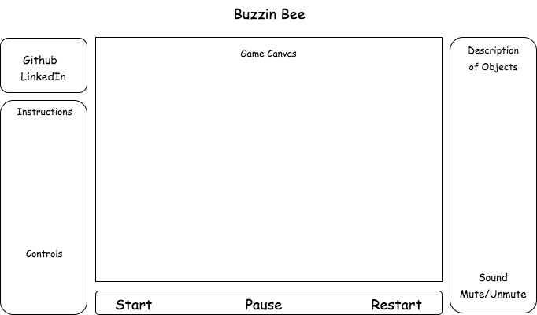

## Buzzin Bee (Jetpack Joyride Inspired)

### Background

Buzzin Bee is a side-scrolling endless flying/action game inspired by Jetpack Joyride. The environment will have objects the player can collect and obstacles to avoid. The objective of the game is to travel as far as possible. The score each game will be kept by tracking the distance they can go before colliding into an obstacle or being caught, which will then end the game.

A more descriptive outline of Buzzin Bee is defined below in **Functionality & MVP**.  

### Functionality & MVP  

With Buzzin Bee, players will be able to:

- [ ] Start and reset the game
- [ ] Jump up and down using the space bar
  - [ ] Collect objects (honey or power-ups)
  - [ ] Avoid obstacles and attacks
- [ ] See their score on the board (Kept track by distance)

In addition, this project will include:

- [ ] A list of instructions describing the rules of the game and controls
- [ ] A production Readme

### Wireframes

This app will consist of a single screen in the center with a side-scrolling gameplay action. There will be a section on the bottom that includes the gameplay buttons for START, PAUSE, and RESTART. Instructions and controls for the game will be found on the lower left side bar. A list describing the different objects in the game will be found on the right side bar. Navlinks to my Github and LinkedIn will be found on the upper left corner. The sound control will be included in the right side bar as well.

### Architecture and Technologies

This project will be implemented with the following technologies:

- Vanilla JavaScript and `jquery` for overall structure and game logic,
- `HTML5 Canvas` for DOM manipulation and rendering; possibly `Easel.js`
- Webpack to bundle and serve up the various scripts.

In addition to the webpack entry file, there will be three scripts involved in this project:

`bee.js` : this script will handle logic regarding collisions with either obstacles or coins and movement

`game.js` : this script will have the creation of the environment, prepare and render the animations to the DOM, and handle score logic

`components.js` : this script will have the creation of different objects (i.e. coins, obstacles)

### Implementation Timeline

**Day 1**: Setup all necessary Node modules, including getting webpack up. Create `webpack.config.js` as well as `package.json`. Write a basic entry file and the bare bones of all 3 scripts outlined above.  Learn the basics of `Easel.js` and see if it would be beneficial to have for my app. Goals for the day:

- Get a green bundle with `webpack`
- Learn more about `Canvas`, `Sprites` and `Easel.js`
- Find/create animations to be used for components, characters, background, and environment

**Day 2**: First, use `game.js` to build the environment for the game and make sure it's side-scrolling. Create a `Bee` character and look for animations for other objects needed for the game. Goals for the day:

- Render a simple, side-scrolling gameplay environment to `Canvas` within the `game.js`; Be able to add the `Bee` onto screen
- Complete the `bee.js` module (constructor, collision functions); should be able to jump by using the spacebar

**Day 3**: Be able to render the components onto the screen. Bee should be able to jump and collide with coins to score or obstacles which will end the game.

- Finish creating the different components (coins, obstacles, etc.) and handle logic of their movements
- Have a score to keep track of distance traveled by the `Bee`
- `Bee` should be able to collect coins and game will end when it runs into an obstacle

**Day 4**: Install the controls for the user to interact with the game. Style the frontend, making it polished and professional.  Goals for the day:

- Create game controls for START and STOP
- Have a styled `Canvas`, nice looking controls and title
- Have an increased level of difficulty if score is over a certain amount, keep it challenging
- Add special power-ups and/or animations to the background

### Bonus features

Some features this game can include in the future:

- [ ] Have `Bee` character collect special items; if 3 are collected, it will turn into a `Queen Bee` where it will be similar to an armor
- [ ] Add music or sound effects
- [ ] Have a highest score stored
